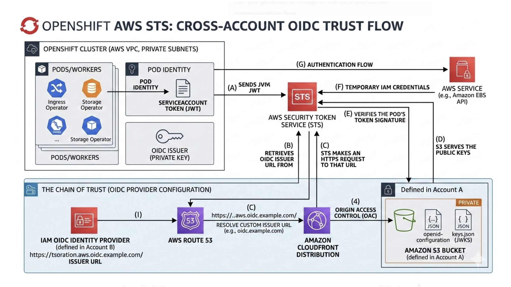

# OpenShift STS enabled cluster on AWS

## Configuration Steps

### Pre Requisite Steps

* Centos / RHEL Bastion host (x86 or aarch64)
* OpenShift command-line interface [oc](https://mirror.openshift.com/pub/openshift-v4/clients/ocp/)
* OpenShift for x86_64 Installer [openshift-install](https://mirror.openshift.com/pub/openshift-v4/clients/ocp/) [1]
* Cloud Credential Operator CLI utility [ccoctl](https://mirror.openshift.com/pub/openshift-v4/clients/ocp/)
* Valid pull-secret from https://console.redhat.com
* ssh-key pair to access the nodes
* aws-cli installed

[0] All the versions of the utilities above need to match!

[1] - The version of `openshift-install` will dictate the version of OpenShift installed on the cluster. `install-config.yaml` does not expose a version for installation. 

## Installation Pre Requisite
The openshift-install tool supports both Installer-Provisioned Infrastructure (IPI) and User-Provisioned Infrastructure (UPI). While the installer can automate VPC creation, it is strongly recommended to provision all network components in advance (UPI). This approach ensures that the cluster and VPC remain two distinct architectural entities, offering better isolation and control.

* IPI (installer provisioned infrastructure) where the installer configures all the vpc componenets (vpc, subnets, igw, routes, etc). The installer treats the cluster and vpc as a single entity. eg when the cluster is destroyed all vpc components are destroyed.
* UPI (user provisioned infrastructure). The vpc and accociated componets are already provisioned in advance.

### Cluster 
Clusters can be deployed with either External or Internal network exposure.
* External: The API and Ingress controllers are exposed to the internet via public-facing Network Load Balancers (NLBs).
* Internal: The API and Ingress controllers are restricted to internal clients via private NLBs.

Regardless of the exposure type, all nodes reside in private subnets. Access is managed through NLBs, which are provisioned in public subnets for external clusters or private subnets for internal clusters.


### VPC Requirments
* VPC sized as 10.0.0.0/16
* DNS resolution enabled
* If Cluster is `Private` - 3 x private subnets one per AZ as /23 or /24.
* If cluster is `Public`, 3 x public subnets one per AZ as /23 or /24 `AND` 3 x private subnets one per AZ as /23 or /24
* Smallest sized subnet would be /27
* Depending on the specific use case managed NAT is a viable option for nodes to egress and reach required registries or a dedicated proxy.
* vpce gateway created and routes added for:
   * s3.`<region>`.amazonaws.com
* vpce created for the following services:
   * sts.`<region>`.amazonaws.com
   * ec2.`<region>`.amazonaws.com
   * elasticloadbalancing.`<region>`.amazonaws.com
   * tagging.`<region>`.amazonaws.com
   * servicequotas.`<region>`.amazonaws.com
* Cross region
  * iam.amazonaws.com
  * route53.amazonaws.com
* Public access (via proxy or managed nat)
  * tagging.us-east-1.amazonaws.com
  * aws.amazon.com

### Route53
A single Route53 hosted zone is required to act as the base domain for the cluster. The hosted zone can either be Public or Private. 
* Public: Needs to be a valid IANA registered domain or a delegated subdomian.
* Private: Only accessable to the VPC and componenets within the vpc.

### OIDC and STS

In an OpenShift STS (Security Token Service) architecture, the S3 bucket and CloudFront distribution serve a single, critical purpose: they host the "Identity Proof" that AWS needs to trust your cluster.

This setup is required because of how IAM Roles for Service Accounts (IRSA) works. 
**`These components are non-negotiable`**.

The Core Problem - Identity 
When an OpenShift operator (like the Ingress Controller) wants to communicate to the underlying AWS infrastructure, it presents a ServiceAccount Token (a JWT).

AWS STS receives this token and asks: "I see this token was signed by 'Cluster-X'. How do I know Cluster-X is legitimate, and where are its public keys so I can verify this signature?"
AWS needs a Public URL (the OIDC Discovery Endpoint) to download two specific files:

`openid-configuration`: A JSON file telling AWS where the keys are.
keys.json (JWKS): The public keys used to verify the cluster's tokens.

The S3 bucket acts as the storage web server for the two files.
When ccoctl is executed, it generates a unique RSA key pair for your cluster.

The Private Key stays inside the cluster (to sign tokens).
The Public Key is uploaded to this S3 bucket so the rest of the world (specifically AWS IAM) can see it.

CloudFront Origin:

Two choices are avilable for how AWS reaches that S3 bucket, and CloudFront is the "Enterprise/Security" choice:

`Option A (Public S3)`: Make the S3 bucket public. Anyone with the URL can see your cluster's public keys. Many corporate security policies strictly forbid public S3 buckets.

`Option B (CloudFront + Private S3)`: Keep the S3 bucket private. Then use CloudFront as a gateway.

CloudFront uses an Origin Access Control (OAC) or Identity (OAI) to "reach into" the private bucket.

AWS IAM then talks to the CloudFront URL to get the keys.

This satisfies security audits because no S3 bucket is set to "Public."

The "Chain of Trust"
The Cluster signs a request with its Private Key.
AWS STS receives the request and looks at the IAM OIDC Identity Provider you created.
The Identity Provider points to your CloudFront URL.
AWS fetches the Public Key from S3 (via CloudFront).
If the keys match, AWS issues temporary credentials to your OpenShift Pod.

If the the S3 bucket or the CloudFront distribution is deleted, the cluster will immediately "lose its connectivity / authority." Operators will no longer be able to create Load Balancers, manage EBS volumes, or update DNS because AWS can no longer verify who the cluster is.




`Phase 1`: The Request (A & B)
(A) Pod Sends JWT: A cluster component (like the Ingress Operator) wants to create an AWS Load Balancer. It sends a ServiceAccount Token (a JSON Web Token or JWT) signed by the cluster’s internal private key to AWS STS.

(B) STS Retrieves Issuer URL: AWS STS receives the token. It looks at the IAM OIDC Identity Provider configuration in your AWS account to find the "Issuer URL" associated with that specific cluster.

`Phase 2`: The Validation (C, D, & E)
(C) STS Makes HTTPS Request: AWS STS needs to verify that the token is authentic. It makes a secure HTTPS call to the CloudFront URL (the Issuer URL) to find the cluster's public keys.

(D) S3 Serves the Public Keys: CloudFront uses Origin Access Control (OAC) to securely pull the openid-configuration and keys.json (JWKS) files from your Private S3 Bucket. These files contain the public part of the key pair used by your OpenShift cluster.

(E) STS Verifies the Signature: AWS STS uses the public keys it just downloaded to verify the digital signature on the Pod's JWT. If the signature matches, STS knows the request is legitimately coming from your cluster.

`Phase 3`: The Authorization (F & G)
(F) Temporary IAM Credentials: Once verified, STS generates Short-lived IAM Credentials (Access Key, Secret Key, and Session Token) tied to the specific IAM Role defined for that operator.

(G) Authentication Flow Complete: The Pod receives these temporary credentials and uses them to call the AWS Service API (e.g., EC2, EBS, or Route 53) to complete its work.


### Bastion Host
* If the cluster is External a laptop or ec2 instance will be sufficient to deploy the cluster
* If the cluster is Internal an ec2 instance in the VPC is needed or a device internally connected to the vpc.
* Centos / RHEL Bastion host (x86 or aarch64)
* AWS credentials as either a user or role/policy with `arn:aws:iam::aws:policy/AdministratorAccess` associated.  
   * Best practice would have a policy with a limited set of permissions to create the cluster. See https://docs.redhat.com.
* All the utilites avaiable see above


## Cluster Installation
When `openshift-install` is run with standard configuration the OpenShift cluster will be installed `without` STS being enabled. The cluster has zero intergation with the AWS infrastructure. The cluster can't be retrofitted after installation to enable STS. 

When building an STS enabled OpenShift cluster on aws additional steps are required to generate the specific manifests for installation coupled with the Cloud Credential Operator CLI utility to create the Cloud Front origin and s3 bucket for the OICD to work as expetced with the aws STS service. 

### Generate ssh-key
```
$ ssh-keygen -t rsa -N "" -f ~/.ssh/cluster_rsa
```

### pull-secret
```
$ echo "pull-secret" > ~/.config/containers/auth.json
```

### aws command
```
$ aws sts get-caller-identity
```

### Cluster Name
The cluster_name in install-config.yaml `installconfig.spec.metadata.name` and the name used for the `ccoctl --name` option **must be identical**.

### Create install-config.yaml
Review the available options.

`Note`: Not all options are displayed in the explain.  
```
$ openshift-install explain installconfig
```
See: [openshift-installer](https://github.com/openshift/installer/blob/main/docs/user/aws/customization.md)

Validated ec2 Instances: [x86_64](https://github.com/openshift/installer/blob/main/docs/user/aws/tested_instance_types_x86_64.md)

```
$ mkdir cluster-install && cd cluster-install
$ mkdir sts-config
$ vim install-config.yaml
$ mkdir installation_dir
$ cp install-config.yaml installation_dir
```

```
# install-config.yaml
apiVersion: v1
additionalTrustBundlePolicy: Proxyonly
baseDomain: apps.example-int.com
compute:
- architecture: amd64
  hyperthreading: Enabled
  name: worker
  platform:
    aws:
      type: m5.xlarge
      rootVolume:
        iops: 5000
        size: 150
        type: io2
        kmsKeyARN: arn:aws:kms:ap-southeast-2:111122223333:key/1234abcd-12ab-34cd-56ef-1234567890ab
      zones:
      - ap-southeast-2a
      - ap-southeast-2b
      - ap-southeast-2c
  replicas: 3
controlPlane:
  architecture: amd64
  hyperthreading: Enabled
  name: master
  platform:
    aws:
      type: m5.xlarge
      zones:
      - ap-southeast-2a
      - ap-southeast-2b
      - ap-southeast-2c
  replicas: 3
metadata:
  name: one
networking:
  clusterNetwork:
  - cidr: 10.128.0.0/14
    hostPrefix: 23
  machineNetwork:
  - cidr: 10.0.0.0/16
  serviceNetwork:
  - 172.30.0.0/16
  networkType: OVNKubernetes
platform:
  aws:
    region: ap-southeast-2
    propagateUserTags: true
    lbType: NLB
    vpc:
      subnets:
      - id: subnet-0dc16b3393c7c4f4c
      - id: subnet-02da6c924d215b397
      - id: subnet-0874ee309e2eb91d3
      - id: subnet-098aa464a25a4b727
      - id: subnet-04eb13a7b562b887b
      - id: subnet-0639cb1ab53f47828
publish: External
credentialsMode: Manual
pullSecret: <pull-secret>
sshKey: <ssh_public_key>

```

### Generate manifests - Part 1
The cluster install version will be `4.20.4` meaning the [openshift-install](https://mirror.openshift.com/pub/openshift-v4/clients/ocp/4.20.4/openshift-install-linux-4.20.4.tar.gz) version needs to match.

```
$ oc adm release extract --credentials-requests --cloud=aws --to=./sts-config quay.io/openshift-release-dev/ocp-release:4.20.4-x86_64
$ oc adm release extract --install-config=./install-config.yaml --included --credentials-requests --cloud=aws --to=./sts-config quay.io/openshift-release-dev/ocp-release:4.20.4-x86_64

```

### Create the CloudFront Origin and s3 Bucket
```
$ ccoctl aws create-all --name=one --region=ap-southeast-2 --output-dir=cco-config --create-private-s3-bucket --credentials-requests-dir=./sts-config

```

### Generate manifests - Part 2
install-config.yaml is consumed/deleted at this stage
```
$ openshift-install create manifests --dir=./installation_dir
$ cp cco-config/manifests/* ./installation_dir/manifests/
$ cp -r cco-config/tls ./installation_dir/
```

### Start the Cluster Build
```
$ openshift-install create cluster --dir=./installation_dir --log-level=info
```

Credentials for the Cluster are displayed at the end of a successful Cluster build.


## Cluster Testing
Items to review

### Login

```
$ oc login <url> -u kubeadmin -p <password>
$ oc get cm cluster-config-v1 -o yaml -n kube-system

# review and confirm the OIDC url is what was created using ccoctl
$ oc get authentication cluster -o yaml
$ oc get cloudcredentials cluster -o yaml
$ oc get secret cloud-credentials -n openshift-ingress-operator -o json | jq -r .data.credentials | base64 -d
$ oc get nodes
$ oc get pods -A
```

## Destroy the Cluster 
```
$ openshift-install destroy cluster --dir=./installation_dir --log-level=info
```

### Destroy the cloudfront oidc / bucket
```
$ ccoctl aws delete --name=one --region=ap-southeast-2
```


